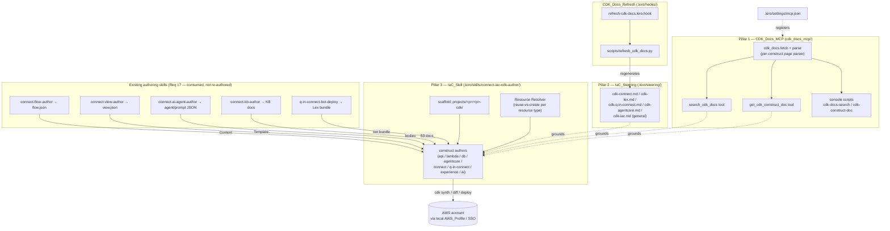

# Design — Connect IaC (CDK for Python)

## Overview

This feature adds an AWS CDK (Python) Infrastructure-as-Code capability
to `connect-skills`. It does **not** invent a new convention; it
replicates three patterns the repo already runs in production and binds
them to a new domain (CDK authoring for the Connect AI deployment
chain):

1. **`CDK_Docs_MCP`** — a second FastMCP / `uv` / console-script server
   living in a sibling folder `cdk_docs_mcp/`, modeled 1:1 on
   `connect_knowledge_mcp/`. It fetches, parses, searches, and
   deep-dives the AWS CDK (Python) reference for the four in-scope
   construct libraries (`aws_cdk.aws_connect`, `aws_cdk.aws_lex`,
   `aws_cdk.aws_wisdom`, `aws_cdk.aws_bedrockagentcore`).

2. **`IaC_Steering`** — five `inclusion: manual` steering catalogs (four
   per-domain CDK construct catalogs + one general IaC file), modeled on
   `connect-blocks.md` / `connect-flow-language.md` / `connect-views.md`
   (front matter with `last_refreshed` + `source_urls` + `content_checksum`,
   7-day freshness rule), regenerated by `CDK_Docs_Refresh` following the
   `refresh-*.kiro.hook` + `.kiro/hooks/scripts/` pattern.

3. **`IaC_Skill`** — a self-contained Kiro skill that scaffolds a CDK
   Python project at `projects/<project>/<project>-cdk/` (per-resource-type
   subfolders) and authors the constructs that provision — or reference,
   when already present — the full Connect AI deployment chain.

Two facts about the target domain shape every decision in this design,
and were verified against the live CDK reference:

- **Connect, Lex, and Wisdom expose only L1 (`Cfn*`) constructs in CDK.**
  The `aws-cdk-lib.aws_connect` module README states plainly there are no
  hand-written L2 constructs yet; the same holds for `aws_lex` and
  `aws_wisdom`. Every construct this skill authors for those services is
  a `Cfn*` resource (e.g. `CfnInstance`, `CfnContactFlow`, `CfnView`,
  `CfnBot`, `CfnAssistant`, `CfnKnowledgeBase`). The design treats L1 as
  the baseline, not a fallback.
- **`aws_cdk.aws_bedrockagentcore` exposes `CfnGateway` and
  `CfnGatewayTarget` (L1).** An L2 lives only in the separate
  `aws-bedrock-agentcore-alpha` package, which this design does **not**
  take a hard dependency on. The AgentCore gateway construct is built on
  `CfnGateway` / `CfnGatewayTarget`, matching the referenced
  `agentcore-gateway-primitive` pattern.

The central architectural problem is **reuse-vs-create** (Requirement 6):
authors frequently already own parts of the chain (a live Connect
instance, an existing AgentCore gateway). The design answers this with a
single, uniform **Resource Resolver** pattern applied to every
provisionable dependency, so "reference the existing one or provision a
new one" is decided in exactly one place per resource type.

### Research notes informing the design

- **CDK construct availability** (CDK API reference v2, Python): Connect /
  Lex / Wisdom are L1-only; `bedrockagentcore` has `CfnGateway` +
  `CfnGatewayTarget`. Source pages:
  [`aws_cdk.aws_connect`](https://docs.aws.amazon.com/cdk/api/v2/python/aws_cdk.aws_connect/README.html),
  [`aws_cdk.aws_lex`](https://docs.aws.amazon.com/cdk/api/v2/python/aws_cdk.aws_lex.html),
  [`aws_cdk.aws_wisdom`](https://docs.aws.amazon.com/cdk/api/v2/python/aws_cdk.aws_wisdom.html),
  [`aws_cdk.aws_bedrockagentcore`](https://docs.aws.amazon.com/cdk/api/v2/python/aws_cdk.aws_bedrockagentcore.html).
- **AgentCore gateway shape**: `CfnGateway(protocol_type="MCP", authorizer_type=..., role_arn=...)`
  then `CfnGatewayTarget(...)` carrying the target configuration. The
  referenced [agentcore-gateway-primitive](https://github.com/ensamblador/agentcore-gateway-primitive/blob/main/agent_core/agent_core_gateway.py)
  uses `authorizer_type="AWS_IAM"` with a Lambda target; Requirement 8
  instead needs a **JWT inbound authorizer** (discovery URL derived from
  the Connect instance OIDC endpoint, audience = gateway id) and a **REST
  API target described by an OpenAPI schema read from S3**.
- **Existing repo conventions** were read directly from
  `connect_knowledge_mcp/` (server + `connect_knowledge` package + CLIs),
  `.kiro/hooks/scripts/refresh_connect_blocks.py` + `_doc_fetcher.py`, the
  `refresh-*.kiro.hook` definitions, the steering front matter, and the
  `workspace-restructure-iac` design. The new components mirror these
  exactly so there is no second convention to maintain.

## Architecture



### How the three pillars relate

- `CDK_Docs_MCP` and `IaC_Steering` are the **knowledge plane** — they
  answer "what construct, what properties, what shape" the same way
  `connect_knowledge` + `#connect-blocks` answer "what flow block".
- `CDK_Docs_Refresh` keeps the steering plane current, exactly as the
  existing refresh hooks keep `connect-blocks.md` current.
- `IaC_Skill` is the **authoring plane** — it consumes the knowledge
  plane (and the artifact bodies produced by the existing authoring
  skills) and emits a deployable CDK app.

### Repository placement

```
connect-skills/
├── connect_knowledge_mcp/          # EXISTING — untouched (Req 17.3)
├── cdk_docs_mcp/                   # NEW — pillar 1, sibling of connect_knowledge_mcp
│   ├── README.md
│   ├── pyproject.toml              # name = "cdk-docs-mcp"; uv-runnable; console scripts
│   ├── cdk_docs_mcp.py             # FastMCP("cdk_docs") + @mcp.tool()s
│   └── cdk_docs/                   # the package (fetch / parse / search / cli)
│       ├── __init__.py
│       ├── fetch.py                # HTTP fetch (mirrors connect_knowledge/docs.py)
│       ├── construct_doc.py        # per-construct page parser
│       ├── search.py               # search over the CDK reference
│       └── cli.py                  # console-script entry points
├── projects/<project>/<project>-cdk/   # NEW — pillar 3 output (per project)
└── .kiro/
    ├── settings/mcp.json           # NEW second server entry (Req 2) — existing entry untouched
    ├── hooks/
    │   ├── refresh-cdk-docs.kiro.hook        # NEW (Req 4)
    │   └── scripts/refresh_cdk_docs.py       # NEW — reuses _doc_fetcher.py
    ├── steering/
    │   ├── cdk-connect.md          # NEW (Req 3) — 5 catalogs
    │   ├── cdk-lex.md
    │   ├── cdk-q-in-connect.md
    │   ├── cdk-agentcore.md
    │   └── cdk-iac.md              # NEW — general IaC steering
    └── skills/
        └── connect-iac-cdk-author/ # NEW (Req 5) — IaC_Skill
            ├── SKILL.md
            └── scripts/            # scaffolding + resolver + construct-author helpers
```

Placing `cdk_docs_mcp/` at repo root, sibling to `connect_knowledge_mcp/`,
keeps each MCP server self-contained with its own `pyproject.toml` and
`uv` environment — the same self-containment principle the
`workspace-restructure-iac` design established.

## Components and Interfaces

### C1 — `CDK_Docs_MCP` (Requirements 1, 2)

A direct structural clone of `connect_knowledge_mcp/`. The server file
declares `FastMCP("cdk_docs")` and exposes the same shape of tools the
existing server exposes, but pointed at the CDK reference.

**Tools (MCP) and their CLI twins:**

| MCP tool | CLI console script | Purpose | Req |
|---|---|---|---|
| `search_cdk_docs(query, limit=10)` | `cdk-docs-search` | free-text search over the CDK reference; returns `Title / URL / Snippet` blocks (same format as `aws_search`) | 1.2, 1.7 |
| `get_cdk_construct_doc(construct, library=None)` | `cdk-construct-doc` | per-construct deep dive; returns parsed `{construct, library, url, properties, raw_sections}` | 1.3, 1.5, 1.7 |

**Underlying package (`cdk_docs/`)** mirrors `connect_knowledge/`:

- `fetch.py` — HTTP GET with retry/back-off, modeled on
  `connect_knowledge/docs.py` (`MAX_RETRIES`, `BACKOFF_BASE`,
  `REQUEST_TIMEOUT`). Fetches the CDK reference page for a construct.
- `construct_doc.py` — parses a CDK construct reference page into a
  structured dict. The parser **MUST** preserve, at minimum, the
  construct name, its property list, and the source URL (Req 1.5). It
  exposes `get_cdk_construct_doc(construct, library)` returning the
  structured result and `raw_sections` escape hatch (same idea as
  `page_doc.get_block_doc`'s `raw_sections`).
- `search.py` — `cdk_search(query, limit)` returning the
  `Title / URL / Snippet` block format identical to `aws_search`.
- `cli.py` — console-script entry points (`docs_main`,
  `construct_main`) that call the **same** package functions the MCP
  tools call, so output is identical (Req 1.7 parity).

**Construct-library scope (Req 1.4):** the parser/search are
parameterized by a closed `LIBRARIES` set:
`{aws_cdk.aws_connect, aws_cdk.aws_lex, aws_cdk.aws_wisdom,
aws_cdk.aws_bedrockagentcore}`. Each maps to its README/landing URL
(the four source URLs in the spec).

**Error result (Req 1.6):** when a construct or page cannot be retrieved
or parsed, the tool returns a descriptive error string/dict that names
the requested identifier and the reason (e.g.
`"Could not retrieve construct 'CfnFoo' in aws_cdk.aws_connect: 404 …"`),
mirroring how `aws_search` returns `"Error searching AWS docs: …"`
rather than raising.

**Registration (Req 2):** add a second top-level entry `cdk_docs` to
`.kiro/settings/mcp.json` (the existing `connect_knowledge` entry is left
byte-for-byte unchanged), with:
- `command` = absolute path to the `uv` binary (same value the existing
  entry resolves to),
- `args` = `["run", "--directory", "<abs>/cdk_docs_mcp", "python", "cdk_docs_mcp.py"]`,
- `disabled: false`,
- `autoApprove` listing the read-only tools (`search_cdk_docs`,
  `get_cdk_construct_doc`).

### C2 — `IaC_Steering` (Requirement 3)

Five `inclusion: manual` steering files, each with the same front-matter
contract as `connect-blocks.md`:

```yaml
---
inclusion: manual
last_refreshed: <YYYY-MM-DD>
construct_count: <n>          # catalog files only
source_urls:
  - <CDK reference URL>
content_checksum: sha256:<16-hex>
---
```

| File | Domain | Source URL |
|---|---|---|
| `cdk-connect.md` | `aws_cdk.aws_connect` constructs | `.../aws_cdk.aws_connect/README.html` |
| `cdk-lex.md` | `aws_cdk.aws_lex` constructs | `.../aws_cdk.aws_lex.html` |
| `cdk-q-in-connect.md` | `aws_cdk.aws_wisdom` constructs | `.../aws_cdk.aws_wisdom.html` |
| `cdk-agentcore.md` | `aws_cdk.aws_bedrockagentcore` constructs | `.../aws_cdk.aws_bedrockagentcore.html` |
| `cdk-iac.md` | general: project layout, bootstrap/synth/diff/deploy, resolver pattern, security baseline | — (hand-curated, not catalog-generated) |

**Catalog entry shape (Req 3.3):** each construct is one table row —
`construct name | one-line description | link to its CDK doc page` —
exactly like the `connect-blocks.md` rows (`| Block | Channels |
Description |`). The four catalog files are machine-generated; `cdk-iac.md`
is hand-authored prose (conventions, not a construct list) but carries
the same front matter and freshness rule.

**Freshness rule (Req 3.6):** each file embeds the same agent-facing rule
as `connect-blocks.md`: "if `last_refreshed` is more than 7 days before
today, run `CDK_Docs_Refresh` before relying on the catalog."

### C3 — `CDK_Docs_Refresh` hook (Requirement 4)

A `.kiro.hook` + script pair, modeled on `refresh-connect-blocks`:

- `.kiro/hooks/refresh-cdk-docs.kiro.hook` — `userTriggered`,
  `runCommand: uv run python .kiro/hooks/scripts/refresh_cdk_docs.py`,
  same JSON shape as the existing hooks.
- `.kiro/hooks/scripts/refresh_cdk_docs.py` — fetches the four CDK
  reference pages (reusing `_doc_fetcher.fetch_with_fallback` for
  404 self-healing), parses each into a construct catalog, and rewrites
  the four `cdk-*.md` catalog files. It updates `last_refreshed` and
  `content_checksum` on every write (Req 4.3), supports `--dry-run`
  (print, no write — Req 4.4), and on a fetch failure reports the failing
  source URL and **leaves that file unchanged** (Req 4.5).

The checksum is computed exactly as `refresh_connect_blocks.py` does:
`"sha256:" + sha256(table_body).hexdigest()[:16]`, so a no-diff
regeneration only bumps `last_refreshed`.

### C4 — `IaC_Skill` (Requirement 5)

A self-contained skill `.kiro/skills/connect-iac-cdk-author/` with a
`SKILL.md` (front matter `name` + `description`, like the other skills)
and a `scripts/` folder. Responsibilities:

**Scaffolding (Req 5.2–5.7):** create the CDK app at
`projects/<project>/<project>-cdk/` via one of two equally-supported
options the skill MAY choose between:
- **CLI option (Req 5.5):** `cdk init app --language=python`, then create
  the project-local venv and install from the pinned `requirements.txt`.
- **Manual option (Req 5.6):** write the equivalent structure (app entry,
  `cdk.json`, `requirements.txt`, `stacks/`, per-resource-type subfolders)
  directly, then the same venv + pinned install. Used when the CDK CLI is
  unavailable, but permitted either way.

Both paths converge on the **same** project layout (C7) and the same
pinned-requirements venv (Req 5.4), and both must pass the `cdk synth`
gate (Req 5.7, 16.2) before the scaffold is reported complete.

**Construct authoring:** per-resource-type author helpers emit constructs
into the project subfolders, each going through the Resource Resolver
(C5). The skill consumes existing artifact bodies (C6) rather than
re-authoring them.

### C5 — Resource Resolver: the reuse-vs-create pattern (Requirement 6) — KEY DESIGN

This is the spine of the feature. Every provisionable dependency
(Connect instance, AgentCore gateway / MCP backend, Q in Connect domain,
knowledge base, Lex bot, and the rest) is bound through **one** resolver
per resource type. The resolver is a pure decision function over three
inputs and returns a uniform **`ResourceHandle`** the dependent
constructs bind to without caring whether it was imported or created.

```
resolve(resource_type, existing_id, force_new) -> ResourceHandle

decision table (Req 6.1, 6.2, 6.3):
  force_new == True                      -> PROVISION new   (6.3)
  existing_id is supplied (not None/"")  -> REFERENCE existing (6.1)
  otherwise                              -> PROVISION new   (6.2)
```

**`ResourceHandle`** is a small uniform record:
`{ kind: "imported" | "created", identifier, arn, ref }` where `ref` is
either the imported reference (from a `from*Attributes` / `fromArn` /
`CfnParameter` / context lookup) or the freshly created `Cfn*` construct.
Dependent constructs (C-series below) call `handle.identifier` /
`handle.arn` and never branch on `kind` themselves — the branch happens
once, in the resolver (Req 6.5: a dependent construct binds to whichever
resource is in use).

**Binding mechanics by resource type.** Because Connect / Lex / Wisdom
are L1-only, "reference an existing resource" rarely has a
`from*Attributes` L2 helper; the resolver therefore standardizes on:
- **Imported handle** = wrap the supplied `existing_id` (or its ARN) as a
  plain value / `CfnParameter` / `Fn.import_value`, surfaced through the
  same `ResourceHandle.identifier` / `.arn` fields. No new `Cfn*` resource
  is added to the template for that dependency.
- **Created handle** = instantiate the `Cfn*` construct and expose its
  `.ref` / `.attr_*` outputs through the handle.

**Unresolved identifier (Req 6.6):** if `existing_id` is supplied but
cannot be resolved to a reachable resource (validated at synth/lookup
time via a pre-flight existence check or a `cdk context` lookup), the
resolver **reports the unresolved identifier and aborts that binding** —
it MUST NOT silently fall through to provisioning a duplicate. This is
the single most important safety behavior of the pattern.

This resolver is the consolidation point for Requirements 8.1–8.2, 9.1–9.2,
10.1–10.4, 11.2–11.3 — every "WHERE existing id supplied → reference, else
provision" clause is one resolver call, not bespoke per-construct logic.

### C6 — Construct authors per domain (Requirements 7–14)

Each author helper emits constructs into the right project subfolder and
binds through the resolver (C5) and consumes existing artifact bodies (C8):

| Author | Constructs (all L1 `Cfn*` unless noted) | Subfolder | Req |
|---|---|---|---|
| Backend API | `aws_apigateway` REST API from an OpenAPI schema artifact | `apis/` | 7.1, 7.4 |
| Compute | `aws_lambda.Function` backing API operations | `lambda/` | 7.2 |
| Data | `aws_dynamodb.Table` | `databases/` | 7.3 |
| AgentCore gateway | `CfnGateway` + `CfnGatewayTarget` (C7) | `apis/agentcore/` | 8 |
| Connect instance | `CfnInstance` (or imported handle) | `connect/` | 9 |
| Q in Connect | `CfnAssistant` + `CfnAssistantAssociation`; KB via `wisdom.CfnKnowledgeBase` over S3 | `connect/q/` | 10 |
| Integrations | MCP integration, Lex (`lex.CfnBot` + Connect bot association), Lambda association | `connect/integrations/` | 11 |
| Experience | `CfnContactFlow`, `CfnView` | `connect/experience/` | 12 |
| AI config | AI agent, AI prompts, guardrail reference, AI agent tools (incl. MCP integration tools) | `connect/ai/` | 13 |
| Security | Connect security profiles | `connect/security/` | 14 |

The Connect instance identifier (created or imported) is published by the
resolver once and threaded into every dependent association (Req 9.3).

**Backend API degraded scaffold (Req 7.5):** if the industry-domain
config is missing/invalid, the author reports the invalid config and
still emits a **minimal valid** REST API construct that `cdk synth`s
without error — never a hard failure that leaves the project
unsynthesizable.

### C7 — AgentCore gateway construct (Requirement 8) — KEY DESIGN

Built on the L1 `CfnGateway` + `CfnGatewayTarget` (the only constructs
the CDK module exposes), following the referenced
`agentcore-gateway-primitive` structure but with two requirement-driven
deviations: a **JWT inbound authorizer** and a **REST-API/OpenAPI target
read from S3**.

```
CfnGateway(
    protocol_type = "MCP",
    authorizer_type = "CUSTOM_JWT",                    # Req 8.5 (not AWS_IAM)
    authorizer_configuration = {
        custom_jwt = {
            discovery_url = f"https://{instance_alias}.my.connect.aws/.well-known/openid-configuration",
            allowed_audience = [ gateway_identifier ],  # Req 8.5: audience = gateway id
        }
    },
    role_arn = gateway_role.role_arn,
)

CfnGatewayTarget(
    gateway_identifier = gateway.attr_gateway_identifier,
    target_configuration = { mcp = { openApiSchema = {                # Req 8.3, 8.4
        s3 = { uri = "s3://<bucket>/<key>" }   # OpenAPI schema read from S3
    }}},
    credential_provider_configurations = [ ... ],
)
```

- **Reuse-vs-create (Req 8.1, 8.2):** routed through the resolver (C5).
  When an existing gateway / MCP backend id/ARN is supplied, the construct
  is skipped and the imported handle is used.
- **Discovery URL derivation (Req 8.5):** a pure function
  `oidc_discovery_url(instance_alias) = "https://" + instance_alias +
  ".my.connect.aws/.well-known/openid-configuration"`; `allowed_audience`
  is set to the gateway identifier. This derivation is unit/property
  testable independently of any AWS call.
- **MCP backend exposure (Req 8.6):** the resulting MCP server backend
  (gateway URL / id) is published as a `ResourceHandle` / stack output so
  the AI-agent author (C6) can wire it as an `MCP_Integration` tool
  (Req 11.1, 13.4). Note `allowed_audience = gateway id` creates a
  derivation order constraint (gateway must exist/own its id before the
  authorizer audience is finalized), handled with `add_dependency` as the
  reference primitive does.

### C8 — Integration with existing authoring skills (Requirement 17)

The `IaC_Skill` **consumes outputs, never re-authors bodies**:

| Existing skill | Output artifact | Bound into |
|---|---|---|
| `connect-flow-author` | `projects/<p>/flows/<f>/flow.json` | `CfnContactFlow.content` (the validated Flow language JSON string) |
| `connect-view-author` | `projects/<p>/views/<v>/view.json` (+ `view-content.json`) | `CfnView.template` / `CfnView` content |
| `connect-ai-agent-author` | agent + prompt JSON bodies | AI agent / AI prompt construct bodies |
| `connect-kb-author` | KB source documents | S3 source for the `wisdom.CfnKnowledgeBase` |
| `q-in-connect-bot-deploy` | Lex import bundle / params | `lex.CfnBot` definition + Connect bot association |

The constructs read these files as **inputs** (e.g. `CfnContactFlow`'s
`Content` is the file's contents). The skill does not duplicate the
flow/view/agent authoring logic; if a body is missing, it directs the
operator to the owning skill. The existing `connect_knowledge` MCP, its
tools, the existing steering catalogs, and the existing skills are left
functional and unchanged (Req 17.3).

### C9 — Security / credential handling (Requirement 15)

- All AWS access resolves from the operator's local `AWS_Profile` / SSO
  at deploy time (Req 15.1) — the CDK app and skill never read or write
  credentials.
- **No-secrets invariant (Req 15.2):** no generated artifact (CDK code,
  `cdk.json`/context, steering, SKILL.md, OpenAPI schema, spec) contains
  AWS access keys, secret keys, or session tokens. Account-bound values
  (account id, ARNs) come from `CDK_Project` context / env
  (`Stack(env=...)` from `CDK_DEFAULT_ACCOUNT` / `CDK_DEFAULT_REGION`),
  never hardcoded.
- **Missing credentials (Req 15.3):** if a deploy is attempted without
  resolvable credentials, the skill reports "credentials missing" and
  writes **no** credential material into the project.

### C10 — Deployment & verification workflow (Requirement 16)

The `SKILL.md` documents `cdk bootstrap`, `cdk synth`, `cdk diff`,
`cdk deploy` for the project. The skill runs `cdk synth` and reports any
synthesis error **before** any deploy step (the synth-before-deploy gate,
Req 16.2), and runs `cdk diff` against the deployed stack on request,
presenting the diff before provisioning (Req 16.3).

## Data Models

### M1 — CDK construct catalog entry (steering)

```
ConstructCatalogEntry:
  name:        str   # e.g. "CfnInstance"
  description: str    # one-line summary
  url:         str    # link to the construct's CDK doc page
```
A catalog file is an ordered list of these rows plus the front matter
(M4). Mirrors the `connect-blocks.md` row contract.

### M2 — Parsed construct doc (`get_cdk_construct_doc` result)

```
ConstructDoc:
  construct:    str            # construct identifier requested
  library:      str            # one of the four LIBRARIES
  url:          str            # source CDK doc page (preserved verbatim)
  properties:   list[Property] # [{name, type?, required?, description?}]
  description:  str | None
  raw_sections: dict[str,str]  # escape hatch, like page_doc.raw_sections
```
Parse fidelity (Req 1.5) means `construct`, `properties` (non-empty when
the page lists any), and `url` survive parsing intact.

### M3 — `CDK_Project` configuration (reuse-vs-create inputs, Req 6.4)

Supplied via CDK context (`cdk.json` `context` / `-c key=value`) or stack
parameters. Every key is optional; absence means "provision new".

```
CdkProjectContext:
  existing_connect_instance_id | _arn:   str?
  existing_agentcore_gateway_id | _arn:  str?
  existing_q_in_connect_domain_id:       str?
  existing_knowledge_base_id:            str?
  existing_lex_bot_id | _arn:            str?
  force_new:                  map[resource_type -> bool]   # explicit-new override (Req 6.3)
  instance_alias:             str        # for OIDC discovery URL (Req 8.5)
  industry_domain:            str        # selects OpenAPI schema (Req 7)
  # NB: no account ids, keys, or tokens — env comes from AWS_Profile (Req 15)
```

### M4 — Steering front matter

```
SteeringFrontMatter:
  inclusion:        "manual"            # Req 3.4
  last_refreshed:   date (YYYY-MM-DD)   # Req 3.5, 4.3
  source_urls:      list[str]           # Req 3.5
  content_checksum: "sha256:<16hex>"    # Req 3.5, 4.3
  construct_count:  int                 # catalog files only
```

### M5 — `ResourceHandle` (resolver output)

```
ResourceHandle:
  kind:        "imported" | "created"
  identifier:  str          # instance id / gateway id / domain id / bot id …
  arn:         str | None
  ref:         object       # imported reference OR the created Cfn* construct
```
Dependent constructs read `identifier` / `arn` only; `kind` is internal
to the resolver.

### M6 — `CDK_Project` layout contract (Req 5.3)

Modeled on the referenced primitive repos
([appsync-event-lambda-primitive](https://github.com/ensamblador/appsync-event-lambda-primitive),
[connect-webrtc-privacy-bridge](https://github.com/ensamblador/connect-webrtc-privacy-bridge))
— per-resource-type subfolders:

```
projects/<project>/<project>-cdk/
├── app.py                      # CDK app entry
├── cdk.json                    # app command + context (reuse-vs-create keys)
├── requirements.txt            # PINNED deps (aws-cdk-lib, constructs) (Req 5.4)
├── requirements-dev.txt        # optional
├── .venv/                      # project-local venv (Req 5.4) — gitignored
├── README.md                   # bootstrap/synth/diff/deploy (Req 16.1)
├── stacks/
│   └── <project>_stack.py      # composes the constructs, wires the resolver
├── lambda/                     # Lambda constructs + handler code (Req 5.3, 7.2)
├── databases/                  # DynamoDB constructs (Req 7.3)
├── apis/                       # API Gateway REST API (Req 7.1)
│   ├── openapi/<domain>.json   # OpenAPI schema artifact (Req 7.4)
│   └── agentcore/              # AgentCore gateway + target (Req 8)
├── connect/                    # instance, q, integrations, experience, ai, security
└── schemas/                    # shared schema artifacts
```

## Acceptance Criteria Testing Prework

Every acceptance criterion was classified (PROPERTY / EXAMPLE / EDGE_CASE
/ INTEGRATION / SMOKE) via the prework tool. Summary of what landed where:

- **PROPERTY (→ the 11 properties below):** 1.3, 1.5 (parse fidelity);
  1.7 (MCP/CLI parity); 3.3 (catalog completeness); 3.6 (freshness);
  4.3 (checksum integrity); 4.4, 4.5 (refresh write-discipline); the
  whole reuse-vs-create family (6.1, 6.2, 6.3, 6.5, 8.1, 8.2, 9.1, 9.2,
  10.1–10.4, 11.2, 11.3) consolidated into **one** resolver invariant;
  6.6 (unresolved-id safety); 8.5 (discovery-URL derivation); 15.2, 15.3
  (no-secrets); 17.3 (no-regression).
- **INTEGRATION (synth-snapshot / external, 1–3 examples):** 1.4, 4.1,
  5.7, 7.1–7.3, 8.3, 8.4, 10.5, 11.1, 11.4, 12.1, 12.2, 13.1–13.4, 14.1,
  16.2, 16.3 — CDK construct generation and external-toolchain behavior.
- **EXAMPLE:** 1.2, 3.5, 5.2, 5.3, 5.5, 5.6, 6.4, 8.6, 9.3, 17.1.
- **EDGE_CASE:** 1.6 (descriptive error), 7.5 (degraded scaffold).
- **SMOKE (one-time structural/config):** 1.1, 2.1–2.4, 3.1, 3.2, 3.4,
  4.2, 5.1, 5.4, 7.4, 15.1, 16.1, 17.2.

**Property reflection (redundancy elimination):** the per-resource-type
provisioning criteria all reduce to a single universal resolver invariant
(Property 1) — "for all resource types, `resolve(...)` follows the
decision table" — instead of a near-duplicate property per resource.
Parse-fidelity (1.3 + 1.5), write-discipline (4.4 + 4.5), and no-secrets
(15.2 + 15.3) were each merged into one property. Checksum determinism
(3.5) folds into Property 6. Result: 11 non-redundant properties.

## Correctness Properties

*A property is a characteristic or behavior that should hold true across
all valid executions of a system — essentially, a formal statement about
what the system should do. Properties serve as the bridge between
human-readable specifications and machine-verifiable correctness
guarantees.*

This feature is **predominantly Infrastructure-as-Code** (CDK construct
generation, scaffolding, doc fetching, hook wiring), which is mostly
validated by `cdk synth` gates, snapshot/structural checks, and
integration tests rather than property-based tests. However, several
pieces are **pure logic with universal properties** and are genuinely
PBT-amenable: the reuse-vs-create resolver decision, the doc parser, the
MCP↔CLI parity, the OIDC discovery-URL derivation, the catalog/checksum
generators, the no-secrets scan, and the no-regression guarantee. The
properties below cover exactly those.

### Property 1: Conditional-provisioning invariant (reuse vs create)

*For any* resource type and *any* combination of resolver inputs, the
Resource Resolver SHALL: return an **imported** handle (no new `Cfn*`
resource added) when an `existing_id` is supplied and `force_new` is
false; return a **created** handle when no `existing_id` is supplied; and
return a **created** handle whenever `force_new` is true (even if an
`existing_id` is also supplied). The dependent construct SHALL bind to
whichever handle the resolver returns.

**Validates: Requirements 6.1, 6.2, 6.3, 6.5**

### Property 2: Unresolved-identifier safety

*For any* supplied `existing_id` that cannot be resolved to a reachable
resource, the resolver SHALL report the unresolved identifier and SHALL
NOT produce a `created` handle (no duplicate resource provisioned in its
place).

**Validates: Requirements 6.6**

### Property 3: Doc parse fidelity

*For any* in-scope CDK construct reference page that the fetcher
retrieves, parsing the page SHALL preserve the construct name, the source
URL (verbatim), and the property list (non-empty whenever the page
documents at least one property).

**Validates: Requirements 1.3, 1.5**

### Property 4: MCP tool / CLI parity

*For any* lookup input (search query or construct identifier), the result
produced by the `CDK_Docs_MCP` tool and the result produced by the
corresponding console script SHALL be equivalent, because both call the
same underlying package function.

**Validates: Requirements 1.7**

### Property 5: Catalog entry completeness

*For any* generated construct catalog steering file, every catalog entry
SHALL contain a non-empty construct name, a description field, and a link
to that construct's CDK documentation page.

**Validates: Requirements 3.3**

### Property 6: Refresh checksum integrity

*For any* catalog content, the `content_checksum` SHALL be a
deterministic function of that content (identical content → identical
checksum; any content change → a different checksum), and a regeneration
SHALL update both `last_refreshed` and `content_checksum` together.

**Validates: Requirements 4.3**

### Property 7: Refresh write-discipline

*For any* refresh invocation, when run with `--dry-run` the steering files
SHALL be left unchanged, and when a source page fetch fails the
corresponding previously-generated steering file SHALL be left unchanged
(and the failing source URL reported).

**Validates: Requirements 4.4, 4.5**

### Property 8: Steering freshness rule

*For any* steering file and *any* current date, the freshness check SHALL
flag the file as stale (instruct a refresh) if and only if
`current_date - last_refreshed > 7 days`.

**Validates: Requirements 3.6**

### Property 9: AgentCore discovery-URL derivation

*For any* Connect instance alias, the derived inbound-authorization
discovery URL SHALL equal
`https://<instance-alias>.my.connect.aws/.well-known/openid-configuration`
and the allowed audience SHALL equal the gateway identifier.

**Validates: Requirements 8.5**

### Property 10: No-secrets invariant

*For any* artifact the capability generates (CDK code, context/config,
steering, SKILL.md, OpenAPI schema, spec), the artifact SHALL contain no
AWS access key, secret access key, or session token; and *for any* deploy
attempted without resolvable credentials, no credential material SHALL be
written into the `CDK_Project`.

**Validates: Requirements 15.2, 15.3**

### Property 11: No-regression on existing `connect_knowledge`

*For any* existing `connect_knowledge` MCP tool, CLI, steering catalog,
hook, or skill that works before this change, the same invocation SHALL
produce equivalent behavior after this change.

**Validates: Requirements 17.3**

## Error Handling

- **CDK doc page unreachable / unparseable (Req 1.6):** `CDK_Docs_MCP`
  returns a descriptive error result naming the identifier and reason —
  it does not raise — mirroring `aws_search`'s error-string contract.
  `refresh_cdk_docs.py` additionally leans on
  `_doc_fetcher.fetch_with_fallback` for 404 self-healing.
- **Refresh source fetch failure (Req 4.5):** the failing source URL is
  reported and the previously-generated catalog file is left untouched;
  other catalogs still refresh.
- **Unresolved `existing_id` (Req 6.6):** the resolver reports the
  unresolved identifier and aborts the binding — it never falls through
  to provisioning a duplicate.
- **Missing/invalid industry-domain config (Req 7.5):** the backend API
  author reports the invalid config and emits a minimal valid REST API
  scaffold that still `cdk synth`s.
- **Missing AWS credentials at deploy (Req 15.3):** the skill reports
  missing credentials and writes no credential material.
- **Synthesis error (Req 16.2):** `cdk synth` errors are surfaced and
  block any deploy step.
- **Missing upstream artifact body (Req 17.1):** if a flow/view/agent
  body is absent, the skill points the operator to the owning authoring
  skill rather than re-authoring it.

## Testing Strategy

This is an IaC-heavy feature, so the strategy is layered: pure-logic
units get property-based tests; CDK output gets snapshot/synth checks;
external behavior gets a small number of integration tests.

**Property-based tests (the 11 properties above).**
- Library: a standard PBT library for the target language — `hypothesis`
  for the Python pieces (resolver, parser, checksum, freshness,
  discovery-URL, parity, no-secrets scan). Do not hand-roll PBT.
- Minimum **100 iterations** per property test.
- Each test tagged: **Feature: connect-iac-cdk, Property {n}: {property text}**.
- One property → one property-based test.
- The resolver (Property 1, 2), parser (Property 3), parity (Property 4),
  checksum (Property 6), freshness (Property 8), discovery-URL
  (Property 9), and no-secrets scan (Property 10) are all pure functions
  over generated inputs — ideal PBT targets. Catalog completeness
  (Property 5) and write-discipline (Property 7) run the generator over
  generated/parsed inputs with mocked fetches.

**Snapshot / structural tests (the IaC that is *not* PBT-amenable).**
- `cdk synth` snapshot assertions on scaffolded stacks (assert the
  resolver produced an imported reference vs a new `Cfn*` resource for
  given context) — this is how Properties 1–2 manifest at the
  CloudFormation level.
- Front-matter / mcp.json structural assertions (Req 2, 3.4, 3.5).

**Integration / smoke tests (external, 1–3 examples — not PBT).**
- **Synth-before-deploy gate (Req 5.7, 16.2):** scaffold a project and
  assert `cdk synth` exits 0 before any deploy is allowed. Run as a
  gate, not 100 iterations (high cost, deterministic).
- `cdk diff` preview (Req 16.3).
- MCP registration smoke check (Req 2): server entry present, tools
  enumerable.
- A live `CDK_Docs_MCP` fetch against one real CDK page per library
  (Req 1.4) — 1 example each, not property-based (external service).

**No-regression (Property 11):** re-run the existing `connect_knowledge`
tool/CLI/refresh smoke checks after the change and confirm equivalent
output — the same operational verification the
`workspace-restructure-iac` design used.

## Open technical decisions (may seek user input)

- **JWT authorizer property names** on `CfnGateway` (`authorizer_type` /
  `authorizer_configuration` exact keys) should be confirmed against the
  `get_cdk_construct_doc("CfnGateway")` result at implementation time, as
  the L1 surface evolves. The design fixes the *behavior* (discovery URL,
  audience) per Req 8.5; the exact property spelling is an implementation
  detail to verify against live docs.
- **Whether `cdk-iac.md` carries a `content_checksum`** given it is
  hand-authored prose, not generated — proposed: yes, for front-matter
  uniformity, with the checksum over the body so manual edits are still
  detectable.
