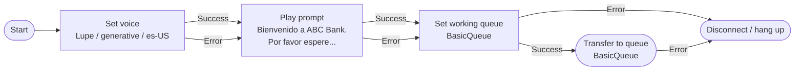

# abc-bank-spanish-welcome — design

Stage-2 deliverable for the `connect-flow-author` skill.

## Spec

| Field | Value |
|---|---|
| Name | `abc-bank-spanish-welcome` |
| Channel(s) | Voice |
| Flow type | Inbound flow |
| Trigger | claimed phone number routed at this flow |
| Voice | Polly **Lupe**, `es-US`, engine `generative` |
| Greeting | "Bienvenido a ABC Bank. Por favor espere, lo conectaremos con un representante." |
| Queue | `BasicQueue` (placeholder — replace with the real queue ARN before deploy) |

### Behavior

1. Set the flow's voice to Lupe / generative / es-US.
2. Play the Spanish greeting.
3. Set the working queue to `BasicQueue`.
4. Transfer the customer to the queue (terminal — this flow ends).

### Branching rules

- **Set voice → Error** → fall forward to the greeting (default voice is acceptable).
- **Play prompt → Error** → fall forward to the queue (TTS failure must not block routing).
- **Set working queue → Error** → end the flow (no queue, no transfer).
- **Transfer to queue → Error** → end the flow (runtime handles disconnect).

Note: the error-sink block is **Disconnect / hang up**
(`DisconnectParticipant`), not **End flow / Resume**. The
`EndFlowExecution` Action is restricted to whisper flows and customer
queue flows — it cannot be used inside an inbound flow. See "Notable
findings during stage 3" below.

## Mermaid sketch

Renders inline in Kiro's markdown preview. Standalone source in
[`flow.mmd`](./flow.mmd) for paste-into-mermaid.live or CLI rendering.



## Block → Action mapping

Final, confirmed by `get_action_doc` for every type:

| Mermaid node | Connect block | Flow language Action type | Notes |
|---|---|---|---|
| Set voice | Set voice | `UpdateContactTextToSpeechVoice` | Params: `TextToSpeechVoice`, `TextToSpeechEngine`. |
| Play prompt | Play prompt | `MessageParticipant` | `Text` is mutually exclusive with `PromptId` and `SSML`. |
| Set working queue | Set working queue | `UpdateContactTargetQueue` | `QueueId` requires the queue ARN. |
| Transfer to queue | Transfer to queue | `TransferContactToQueue` | No parameters. Uses the contact's TargetQueue from the previous action. |
| (error sink) | Disconnect / hang up | `DisconnectParticipant` | `EndFlowExecution` is **not allowed in inbound flows** — switched to `DisconnectParticipant`. |

## Stage 3 deliverable

`flow.json` in this directory. Validated clean by
`validate_flow_json` — zero errors, zero warnings.

```bash
uv run python -c "
from connect_knowledge.validator import validate_flow_json
print(validate_flow_json(open('flow.json').read())['summary'])
"
# Flow is valid. No issues found.
```

### Things to replace before deployment

- **`QueueId`** in the `set-queue` action — currently a placeholder
  (`arn:aws:connect:us-east-1:123456789012:instance/INSTANCE_ID/queue/BASIC_QUEUE_ID`).
  Replace with the real queue ARN from your Connect instance.
  Format: `arn:aws:connect:<region>:<account-id>:instance/<instance-id>/queue/<queue-id>`.

### Notable findings during stage 3

- `EndFlowExecution` is restricted to **whisper flows and customer queue flows** — *not* inbound flows. The error sink had to switch to `DisconnectParticipant`.
- `MessageParticipant` does not take a Polly voice parameter — voice is set globally via the prior `UpdateContactTextToSpeechVoice` action, which is exactly the pattern the design intended.
- `TransferContactToQueue` takes zero parameters — queue is read from the contact's `TargetQueue` set by `UpdateContactTargetQueue`. That two-step pattern (set target then transfer) is the canonical shape.
